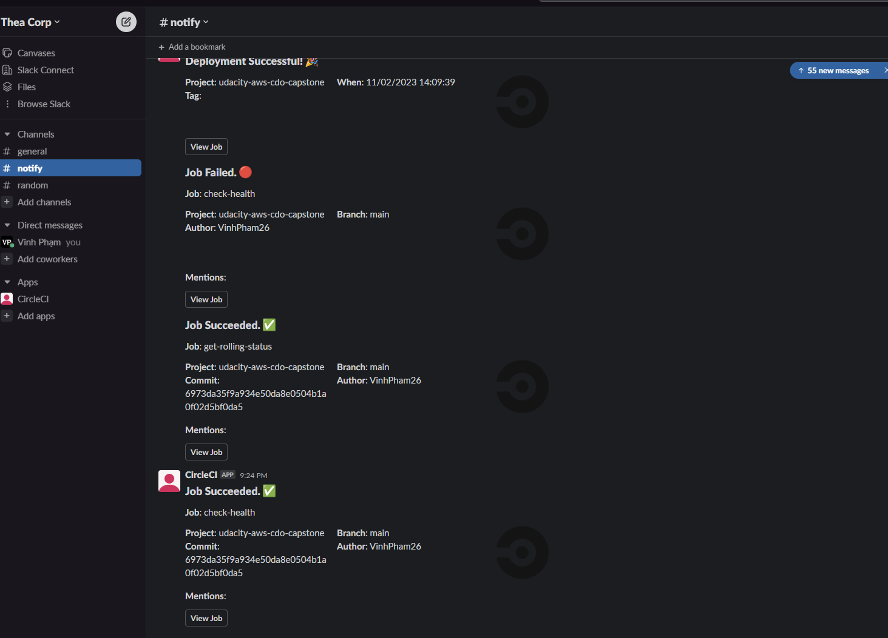

# Udacity Cloud DevOps Engineer: Project 05 - Capstone

This is final project of Udacity Cloud DevOps Engineer Nanodegree Program. In this project we'll apply the skills and knowledge that I've learn from the nanodegree, including:

- Working with AWS
- Using CircleCI to implement CI/CD
- Building pipelines
- Building Kubernetes clusters
- Building Docker containers in pipelines

## Application

This is a simple "Hello, World!" site

## Extra things done in this project

- Integrate Slack to send notification describe the result of the jobs
- Check to see whether the app is successfully running and rolled out

## Steps & Screenshots

1. Creating config file for CircleCI

The pipeline:

Some messages when CircleCI notify to Slack:

2. Deploy our app

- Setup the EKS cluster: I've used `ekscli` to setup the cluster automatically through the pipeline `create-cluster` job

- Try some Hello, World

- Linting the Dockerfile

Lint succeed:

- Build and push the image to dockerhub

- Create and deploy k8s resources

In the `k8s.yml` file, contains all the resources needed for the project. The LoadBalancer get deployed as service with an external IP, running on port 80.

Deployment result:

EC2 nodes:

- For post-deployment step, I've using `curl` to check if the app is up and running at port 80

- Finally, I check if the app successfully rolled out or not

3. Check to see if the app is up and live

Access the app through both the LoadBalancer DNS

## How to access to the app

- Through LoadBalancerDNS: [http://a87e0695e4f474d1a92c4231daaada4f-267950580.us-west-2.elb.amazonaws.com/](http://a87e0695e4f474d1a92c4231daaada4f-267950580.us-west-2.elb.amazonaws.com/)